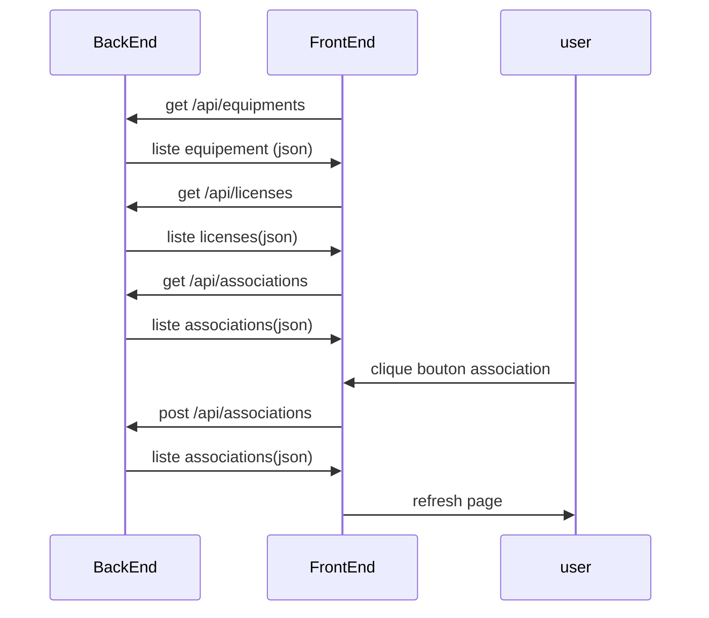

# Welcome to Github vmware-licences-management!

Voici une page web de gestion des licences VMware. Cela permet de faire le lien entre une liste d'equipement et une liste de licence.

# Files
vmware-licences-management
* associations.json	--> fichier de lien entre equipement et licence
* equipments.json	--> fichier equipement
* licenses.json		--> fichier licence


## UML diagrams

## 1st Installation

```
mkdir vmware-licences
cd vmware-licences
npm init -y
npm install express cors body-parser
mkdir public
cd public
cd frontend
npm init vite@latest frontend -- --template vue
npm install
```

## Run

backend :
```
cd vmware-licences
node .\server.js
```
frontend :
```
cd vmware-licences/public/frontend
npm run dev
```

```
## Dockerfile

```

PS D:\Workspace\vmware-licences> docker build -t vmware-licence .
[+] Building 3.7s (10/10) FINISHED                                                                                     docker:default
 => [internal] load build definition from Dockerfile                                                                             0.0s
 => => transferring dockerfile: 810B                                                                                             0.0s
 => [internal] load metadata for docker.io/library/alpine:latest                                                                 1.7s
 => [auth] library/alpine:pull token for registry-1.docker.io                                                                    0.0s
 => [internal] load .dockerignore                                                                                                0.0s
 => => transferring context: 2B                                                                                                  0.0s
 => [1/4] FROM docker.io/library/alpine:latest@sha256:b89d9c93e9ed3597455c90a0b88a8bbb5cb7188438f70953fede212a0c4394e0           0.1s
 => => resolve docker.io/library/alpine:latest@sha256:b89d9c93e9ed3597455c90a0b88a8bbb5cb7188438f70953fede212a0c4394e0           0.1s
 => [internal] load build context                                                                                                0.2s
 => => transferring context: 115.00kB                                                                                            0.1s
 => CACHED [2/4] RUN apk add nodejs                                                                                              0.0s
 => CACHED [3/4] RUN apk add npm                                                                                                 0.0s
 => [4/4] COPY app /opt/                                                                                                         1.2s
 => exporting to image                                                                                                           0.4s
 => => exporting layers                                                                                                          0.4s
 => => writing image sha256:ff85e64c71cf64eb48bfe9faa0c2ef3e058e6aa9edeba8f69756a3e5337ede32                                     0.0s
 => => naming to docker.io/library/vmware-licence                                                                                0.0s

View build details: docker-desktop://dashboard/build/default/default/ls5vf1909wcctpd2eeogqkwlh

What's Next?
  View a summary of image vulnerabilities and recommendations → docker scout quickview
  
```
docker build -t vmware-licence .
docker run -d -it --name vmware-licence -p 3000:3000 -p 5173:5173 vmware-licence
```

```
docker stop vmware-licence; docker rm vmware-licence; docker rmi vmware-licence; docker system prune -a -f
docker build -t vmware-licence . ; docker image ls; docker container ls -a; docker run -d -it --name vmware-licence -p 3000:3000 -p 5173:5173 -v .\app\vmware-licences-management\backend\data\:/opt/vmware-licences-management/backend/data vmware-licence
```

