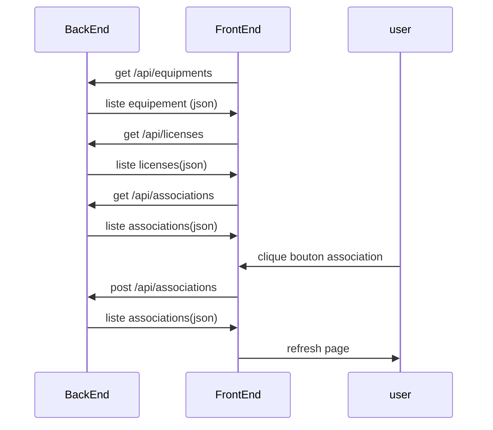

# Welcome to Github vmware-licences-management!

Voici une page web de gestion des licences VMware. Cela permet de faire le lien entre une liste d'equipement et une liste de licence.

# Files
vmware-licences-management
│   associations.json		--> fichier de lien entre equipement et licence
│   equipments.json		--> fichier equipement
│   licenses.json				--> fichier licence
│   server.js					--> backend

|	public							--> frontend

## UML diagrams

You can render UML diagrams using [Mermaid](https://mermaidjs.github.io/). For example, this will produce a sequence diagram:

## 1st Installation

mkdir vmware-licences
cd vmware-licences
npm init -y
npm install express cors body-parser
mkdir public
cd public
cd frontend
npm init vite@latest frontend -- --template vue
npm install

## Run

backend :
cd vmware-licences
node .\server.js
frontend :
cd vmware-licences/public/frontend
npm run dev
